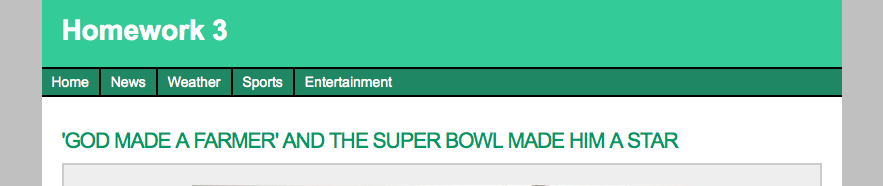

# Homework 3

* [Center thing]()
* [Using Emmet](emmet.html)
* [Box Model](box-model.html)
* [Floats](floats.html)
* [Clear Fix](clear-fix.html)
* [Homework](homework.html)

This weeks we will be using the homework from last week and adding a navigation to it.

Use the starter zip file

[Starter File <i class="icon-download-alt icon-white"></i>](homework3.zip)

## Add HTML

Update the header to say

    Homework 3

In the html file add the correct markup for a navigation

the links should be

    Home -> index.html
    News -> news.html
    Weather -> weather.html
    Sports -> sports.html
    Entertainment -> entertainment.html

Remember that we are creating a list of links.

## Add CSS

Add to the css file the correct styles to make the markup look like a nav.

Nav Bar

    bg color - #208764

Nav Item

    border - 2px on rigth (black)
    Last item should not have a border
    spacing - top and bottom 5px and left and right 10px;

nav links

    color - white
    not underlined

Hover Color

    bg color - #20E8A5
    text color - black

## Coded Page

[View Final Example](homework3/homework3.html)
