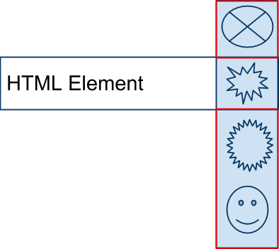
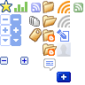

CSS Sprites are an idea of using one image as a background for many elements on the page.

This cuts down on the load time for and the number of assent need for a site.

This idea is used only for background images and is at its most advantage when you are repeating the element many times on your page/site.

The Idea is only the graphic seen in the HTML element would be show.  All other graphics would be hidden.

To view the next graphic the background position would need be change to so the correct graphic would show.  Often the background poistion will be a negative number.

Here the second graphic is shown.

### Example

	selector {
		background-image(images/sprites.png);
		background-position: right -20px;
	}

Notice the -20px that moves the starting point of the time up 20 pixals.  By doing that the image appears to be a whole new graphic but is still the same image.

## Real Example

This is a real world example that google used.  You can see that there are 20 or so graphic on one image.

To expose the graphic of the folder with the small icon the markup would look like this:

	

	

Notice that DIV has no content in it.  In place of the content we use styles to make it seem like the DIV has an image in it.

In this example we use the same image but expose a new image.

	

	

The same image is used for both.
