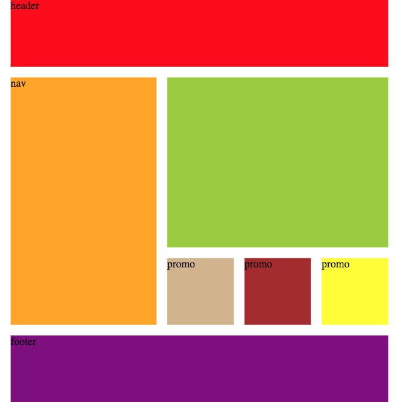

## Basic Grid

Lets look at this design.



Lets add the grid.


We need to build a grid that is 4 columns by 4 rows.

Let start with our HTML

```html
<div class="container">
  <header>header</header>
  <nav>nav</nav>
  <article></article>
  <aside>promo</aside>
  <aside>promo</aside>
  <aside>promo</aside>
  <footer>footer</footer>
</div>
```

Next we need to add our css

<p data-height="440" data-theme-id="light" data-slug-hash="POQaYO" data-default-tab="css" data-user="danhahn" data-embed-version="2" data-pen-title="POQaYO" class="codepen">See the Pen <a href="https://codepen.io/danhahn/pen/POQaYO/">POQaYO</a> by Dan Hahn (<a href="https://codepen.io/danhahn">@danhahn</a>) on <a href="https://codepen.io">CodePen</a>.</p>
<script async src="https://production-assets.codepen.io/assets/embed/ei.js"></script>

<p data-height="440" data-theme-id="light" data-slug-hash="POQaYO" data-default-tab="result" data-user="danhahn" data-embed-version="2" data-pen-title="POQaYO" class="codepen">See the Pen <a href="https://codepen.io/danhahn/pen/POQaYO/">POQaYO</a> by Dan Hahn (<a href="https://codepen.io/danhahn">@danhahn</a>) on <a href="https://codepen.io">CodePen</a>.</p>
<script async src="https://production-assets.codepen.io/assets/embed/ei.js"></script>

## grid-column-start, grid-column-end

Determines a grid item's location within the grid by referring to specific grid lines. grid-column-start/grid-row-start is the line where the item begins, and grid-column-end/grid-row-end is the line where the item ends.

```css
.container header {
  background-color: red;
  grid-column-start: 1;
  grid-column-end: span 4;
}
```

This will start at the first column and span 4 columns resulting in the header display across the top of the page.

## grid-row-start, grid-row-end

```css
.container nav  {
  grid-row-start: 2;
  grid-row-end: 4;
}
```

<p data-height="513" data-theme-id="light" data-slug-hash="NwyzGL" data-default-tab="result" data-user="danhahn" data-embed-version="2" data-pen-title="NwyzGL" class="codepen">See the Pen <a href="https://codepen.io/danhahn/pen/NwyzGL/">NwyzGL</a> by Dan Hahn (<a href="https://codepen.io/danhahn">@danhahn</a>) on <a href="https://codepen.io">CodePen</a>.</p>
<script async src="https://production-assets.codepen.io/assets/embed/ei.js"></script>

We can also use the shorthand of grid-column or grid-row with the start and end.

```css
.container header {
  background-color: red;
  grid-column: 1 / span 4;
}
.container nav  {
  grid-row-start: 2 / 4;
}
```

## using `-1`

There are some case where we want to span from a column to the end of the row.  In that case we replace the end value with `-1`.

```CSS
.container footer {
  background-color: purple;
  grid-column: 1 / -1;
}
```

## Add column or row names

This is what we have to start

```CSS
.container{
  display: grid;
  grid-template-columns: 300px 100px 100px 100px;
  grid-template-rows: 100px 200px 100px 100px;
  grid-gap: 1em;
}
```

but we can add names to the where implied column numbers are.

```CSS
.container{
  display: grid;
  grid-template-columns: [start] 300px [promo1] 100px [promo2] 100px [promo3] 100px [end];
  grid-template-rows: 100px 200px 100px 100px;
  grid-gap: 1em;
}
```

Now we can use the name rather than the numbers.  This can make responsive design a little easy.

<p data-height="559" data-theme-id="light" data-slug-hash="QOQxYe" data-default-tab="css" data-user="danhahn" data-embed-version="2" data-pen-title="QOQxYe" class="codepen">See the Pen <a href="https://codepen.io/danhahn/pen/QOQxYe/">QOQxYe</a> by Dan Hahn (<a href="https://codepen.io/danhahn">@danhahn</a>) on <a href="https://codepen.io">CodePen</a>.</p>
<script async src="https://production-assets.codepen.io/assets/embed/ei.js"></script>

## minmax()

`minmax()` is a new css function that takes a min width and max width and will adjust the size of the based on the size that is available.

```CSS
.container{
  display: grid;
  grid-template-columns: [start] minmax(200px, 300px) [promo1] minmax(100px, 1fr) [promo2] minmax(100px, 1fr) [promo3] minmax(100px, 1fr) [end];
  grid-template-rows: [top] 100px [content] 200px [promo] 100px [footer] 100px [bottom];
  grid-gap: 1em;
}
```

Because we are now using the name rather than the numbers we can center the content using the neat `minmax()` trick;

```CSS
.container{
  display: grid;
  grid-template-columns: minmax(0, 1fr) [start] minmax(200px, 300px) [promo1] minmax(100px, 1fr) [promo2] minmax(100px, 1fr) [promo3] minmax(100px, 1fr) [end] minmax(0, 1fr);
  grid-template-rows: [top] 100px [content] 1fr [promo] 100px [footer] 100px [bottom];
  grid-gap: 1em;
}
```

This adds a column at the start and end of `minmax(0, 1fr)` this will allow for the width to be 0 up to `1fr` unit based on the screen size.

<p data-height="559" data-theme-id="light" data-slug-hash="QOQxYe" data-default-tab="result" data-user="danhahn" data-embed-version="2" data-pen-title="QOQxYe" class="codepen">See the Pen <a href="https://codepen.io/danhahn/pen/QOQxYe/">QOQxYe</a> by Dan Hahn (<a href="https://codepen.io/danhahn">@danhahn</a>) on <a href="https://codepen.io">CodePen</a>.</p>
<script async src="https://production-assets.codepen.io/assets/embed/ei.js"></script>
